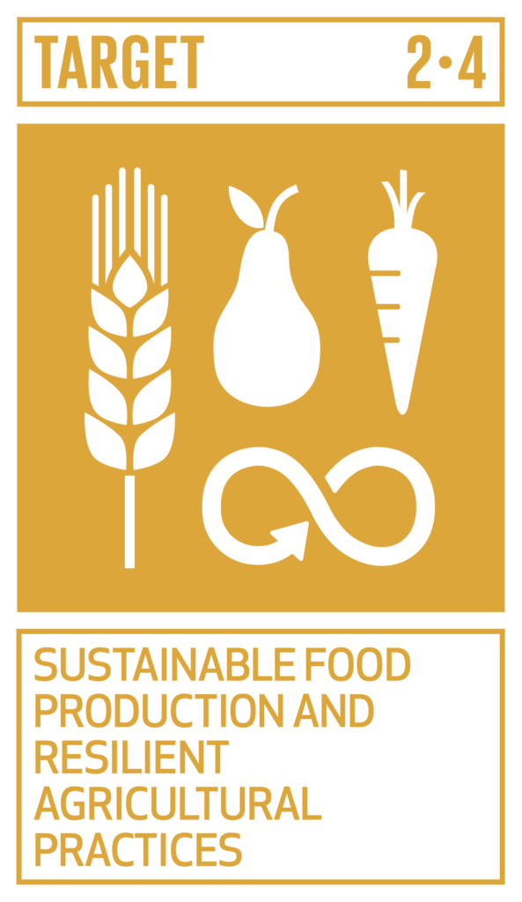
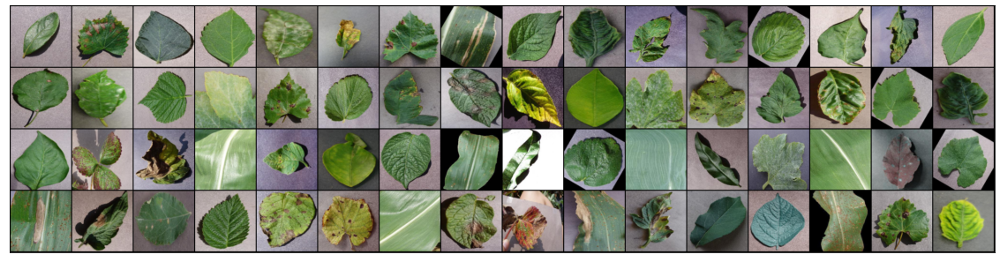
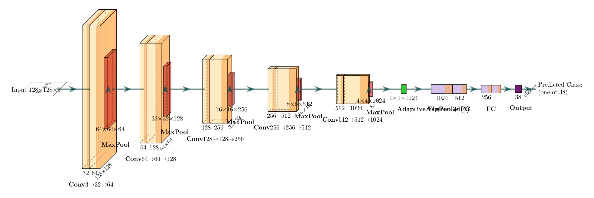
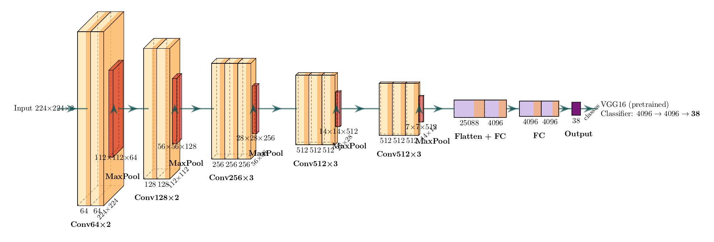
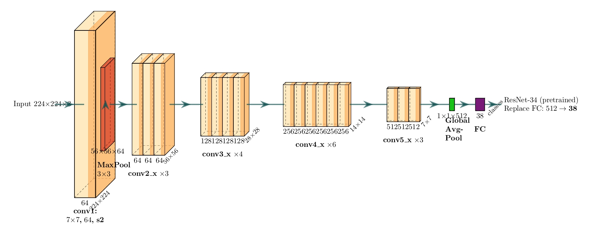
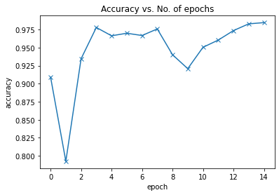
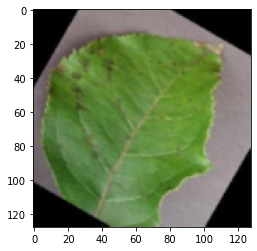

# AGROASSIST - A Agriculture Related AI Reserach 

### Problem Statement 

AgroAssist is an AI-powered application designed to support and optimize agricultural practices. By leveraging advanced machine learning and deep learning techniques, AgroAssist aims to assist farmers with accurate crop recommendations and timely disease detection for improved productivity and sustainable farming.

Despite the region’s rich agricultural heritage, issues such as crop diseases, inefficient farming practices, and a lack of timely, accurate recommendations continue to hinder productivity and sustainability. 

This project works on the following UNSDGs: 

    

# Features 

Agro Assist Consists of three main modules : 

1. Crop Recomendation 
2. Diease Detection 
3. Pest Identifiction

# Identification of Plant Diseases 

The traditional method of disease detection has been to use manual examination by either farmers or experts, which can be time consuming and costly, proving infeasible for millions of small and medium sized farms around the world. This feature is an approach to the development of plant disease recognition model, based on leaf image classification, by the use of deep convolutional networks. The developed model is able to recognize 38 different types of plant diseases out of of 14 different plants with the ability to distinguish plant leaves from their surroundings.

This process for building a model which can detect the disease assocaited with the leaf image. The key points to be followed are:

1. Data gathering

   The dataset taken was **"New Plant Diseases Dataset"**. It can be downloaded through the link "https://www.kaggle.com/vipoooool/new-plant-diseases-dataset". It is an Image dataset containing images of different healthy and unhealthy crop leaves.

   

2. Model building

   - I have used pytorch for building the model.
   - I used three models:-
     1. The CNN model architecture consists of CNN Layer, Max Pooling, Flatten a Linear Layers.
     2. Using Transfer learning VGG16 Architecture.
     3. Using Transfer learning resnet34 Architecture.

The architectures of all three are discussed below: 

This model is a deep convolutional neural network built entirely from scratch to classify leaf images into 38 plant disease categories. It consists of five convolutional blocks, each followed by ReLU activations and max pooling layers to progressively reduce spatial dimensions while increasing feature depth. The network begins with small filters (3→32→64) and expands up to 1024 channels, capturing both low-level and high-level image features. After feature extraction, it applies a global average pooling layer and three fully connected layers (1024→512→256→38) to produce the final class probabilities. This custom model learns all features from the dataset itself, providing high flexibility but requiring more training data and time to generalize effectively.

The model based on VGG16, leverages transfer learning by reusing a pre-trained ImageNet model as a powerful feature extractor. The convolutional layers of VGG16 capture hierarchical texture and color information, while the final fully connected layers are modified to classify 38 plant diseases instead of 1000 ImageNet classes. This structure includes five convolutional blocks with 13 convolution layers in total, followed by three dense layers (4096→4096→38). By fine-tuning only the final layers, the model combines the stability of pre-learned features with the specificity of plant disease patterns, making it effective for medium-sized datasets.

The model is built on ResNet34, introduces residual learning to overcome vanishing gradient issues and improve training efficiency. The architecture begins with a 7×7 convolution and max pooling, followed by four residual stages (3, 4, 6, and 3 blocks respectively) with skip connections that allow the network to learn identity mappings. These connections enable deeper and more stable learning compared to traditional CNNs. The model ends with a global average pooling layer and a single fully connected layer (512→38) that outputs disease classifications. Thanks to its pre-trained ImageNet weights and residual architecture, this model offers high accuracy, faster convergence, and better generalization for plant disease detection.

3. Training

   The model was trained by using variants of above layers mentioned in model building and by varying hyperparameters. The best model was able to achieve 98.42% of test accuracy.

   

4. Testing

   The model was tested on total 17572 images of 38 classes.

5. Result 

The final model being used is Resnet with 98.42% accuracy. 

# Crop Recommendation Using Machine Learning
Crop recommendation is one of the most important applications of precision agriculture. By analyzing soil nutrients, environmental conditions, and weather patterns, this system predicts the most suitable crop to cultivate for a given piece of land.
The goal is to assist farmers in increasing agricultural productivity, preventing soil degradation, reducing chemical usage, and optimizing water and fertilizer resources, ultimately leading to smarter, sustainable farming decisions.

## Dataset
This dataset was build by augmenting datasets of rainfall, climate and fertilizer data available for India.

### Attributes information

| Attribute       | Description                             |
| --------------- | --------------------------------------- |
| **N**           | Ratio of Nitrogen content in soil       |
| **P**           | Ratio of Phosphorous content in soil    |
| **K**           | Ratio of Potassium content in soil      |
| **Temperature** | Temperature in °C                       |
| **Humidity**    | Relative humidity (%)                   |
| **ph**          | Acidity/alkalinity level of soil        |
| **Rainfall**    | Rainfall in mm                          |
| **label**       | Target variable — recommended crop name |

### Methodology
#### Data Preprocessing

1. Loaded the dataset Crop_recommendation.csv using Pandas.
2. Checked for missing values, duplicates, and inconsistent data types.
3. Identified and removed outliers using the Interquartile Range (IQR) method.
4. Split the dataset into training (80%) and validation (20%) sets using train_test_split.

#### Feature Scaling

Applied StandardScaler normalization to balance feature ranges for models that are sensitive to data scale (like SVM and Logistic Regression).

#### Model Selection

Several classical ML models were benchmarked:
1. Logistic Regression
2. Linear Discriminant Analysis (LDA)
3. K-Nearest Neighbors (KNN)
4. Decision Tree (CART)
5. Naive Bayes
6. Support Vector Classifier (SVC)
7. Ensemble Models: Random Forest, AdaBoost, Gradient Boosting, Bagging, Extra Trees

Each model was evaluated using 10-fold cross-validation with accuracy as the metric.

### Experiment Results
* **Data Analysis**
    * All columns contain outliers except for N.
 * **Performance Evaluation**
    * Splitting the dataset by 80 % for training set and 20 % validation set.
 * **Training and Validation**
    * GausianNB gets a higher accuracy score than other classification models.
    * GaussianNB ( 99 % accuracy score )
 * **Performance Results**
    * Training Score: 99.5%
    * Validation Score: 99.3%

| Model               | Accuracy (%) |
| ------------------- | ------------ |
| Logistic Regression | 94.8         |
| Decision Tree       | 97.1         |
| Random Forest       | 98.4         |
| **GaussianNB**      | **99.3**     |

graph TD
    subgraph Baselines
      LR[Logistic Regression]
      LDA[LDA]
      KNN[KNN]
      DT[Decision Tree]
      SVM[SVC]
      NB[GaussianNB]
    end
    subgraph Ensembles
      RF[Random Forest]
      AB[AdaBoost]
      GB[Gradient Boosting]
      ET[Extra Trees]
      BAG[Bagging]
    end
    LR --> Eval((10-fold CV))
    LDA --> Eval
    KNN --> Eval
    DT --> Eval
    SVM --> Eval
    NB --> Eval
    RF --> Eval
    AB --> Eval
    GB --> Eval
    ET --> Eval
    BAG --> Eval
    Eval --> Winner[Select Best GaussianNB]

### Pest Classification

AgroAssist’s Pest Classification feature provides a deep learning-based approach to identifying common agricultural pests, helping farmers implement effective pest control measures. By accurately classifying pest species from images, this feature enables timely intervention, ultimately reducing crop damage and minimizing pesticide use.

# Data Preparation:

Images are preprocessed and augmented using TensorFlow's ImageDataGenerator with an 80/20 split for training and validation.

# Model Architecture:

Base Model: Utilizes ResNet50, a pre-trained deep convolutional network, as the foundation for feature extraction.
Custom Layers: Adds custom layers for improved classification accuracy, including:
Global Average Pooling Layer
Dense layer with 1024 units and ReLU activation
Output layer with softmax activation to classify pest species.

# Training:

The model is initially trained with the base ResNet50 layers frozen, using a learning rate of 0.001.
Fine-Tuning: After initial training, the last 20 layers of ResNet50 are unfrozen, and the model is retrained with a reduced learning rate of 0.00001 to further enhance accuracy.

# Results:

The trained model achieved high test accuracy of 69% , demonstrating reliable pest identification.

### My Contribution:
I conceptualized and developed AgroAssist as a Semester Project of Computer Vision.

# Technology Used 
AgroAssist leverages Python, PyTorch, TensorFlow, scikit-learn, and deep learning architectures like CNN, ResNet50, and VGG16 for crop recommendation, plant disease recognition, and pest classification.

